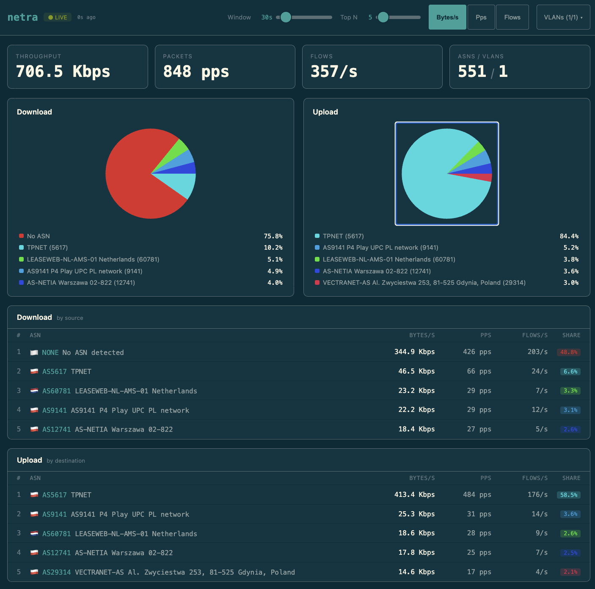

# netra



See what ASNs your network is talking to by analyzing your flow data.

Single binary that collects NetFlow v5/v9 and IPFIX flows, maps destination and source IPs to ASNs using a BGP-derived database, and serves a live monitoring dashboard.

## Quick Start

```bash
just setup    # install frontend dependencies
just build    # build frontend + release binary
./target/release/netra
```

Open `http://localhost:1337` for the dashboard. Point your NetFlow/IPFIX exporter at UDP port `2055`.

## Usage

```
netra [OPTIONS]

Options:
  -f, --flow-port <FLOW_PORT>  UDP port for NetFlow/IPFIX packets [default: 2055]
  -p, --http-port <HTTP_PORT>  TCP port for the HTTP dashboard and SSE API [default: 1337]
  -d, --db-path <DB_PATH>      Path to the ASN database file [default: asndb.netra next to binary]
  -h, --help                   Print help
```

## Default Ports

| Port | Protocol | Purpose |
|------|----------|---------|
| 1337 | TCP/HTTP | Web dashboard + SSE API |
| 2055 | UDP | NetFlow v5/v9, IPFIX |

## Features

- Multi-core UDP processing with SO_REUSEPORT
- NetFlow v5, v9, and IPFIX with template caching
- ASN database from iptoasn.com (auto-downloaded, refreshed daily)
- 5-second tumbling windows with proportional flow attribution
- Upload (by destination ASN) and download (by source ASN) tracking
- Real-time dashboard with Solarized Dark theme
- Per-session SSE streams with configurable window and top-N

## Development

```bash
just dev-backend    # Rust server on :1337
just dev-frontend   # Vite dev server on :5173
just test           # run all tests
just lint           # clippy + eslint
just check          # full CI pipeline
```

## Docker

```bash
docker build -t netra .
docker run -p 1337:1337 -p 2055:2055/udp netra
```

## Architecture

```
UDP :2055 → N listener threads (SO_REUSEPORT)
  → Parse v5/v9/IPFIX → Extract (dst_ip, src_ip, vlan, bytes, timestamps)
  → ASN lookup (ip_network_table trie, ~100ns)
  → DashMap windows (upload by dst, download by src)
  → 5-sec freeze → Arc<FrozenWindow> history (60 windows = 5 min)
  → SSE /api/events (800ms push, per-session config)
  → React dashboard (Recharts, Solarized Dark)
```

## License

MIT
